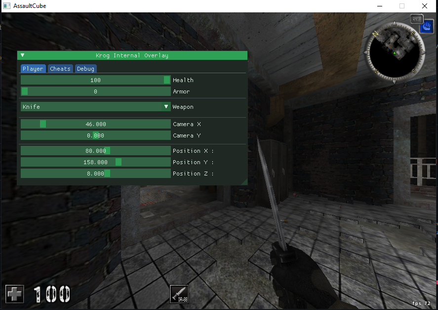

# 100% Internal Overlay

<b>Compilation</b>
<ul>
  <li>Character set : Unicode</li>
  <li>Statically link glew32s.lib</li>
  <li>//!\\ Dynamically link OpenGL32.lib //!\\ </li>
  <li>Preprocessor options : GLEW_STATIC </li>
  <li>Set runtime library to multithread (/MT)</li>
</ul>

<b>TODO</b>
<ul>
  <li> Aimbot </li>
  <li> ESP </li>
  <li> No Recoil </li>
  <li> Rapid Fire </li>
  <li> Infinite Health </li>
  <li> Infinite Armor </li>
  <li> Better ImGUI </li>
</ul>

<b>Features</b>
<ul>
  <li></li>
</ul>
